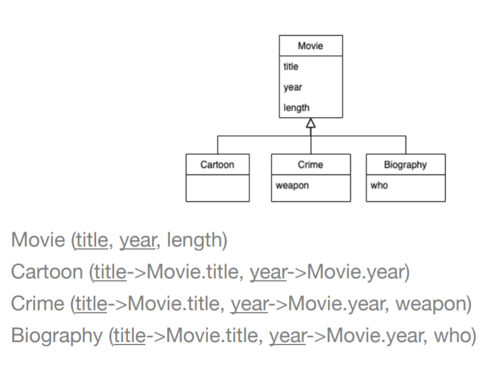
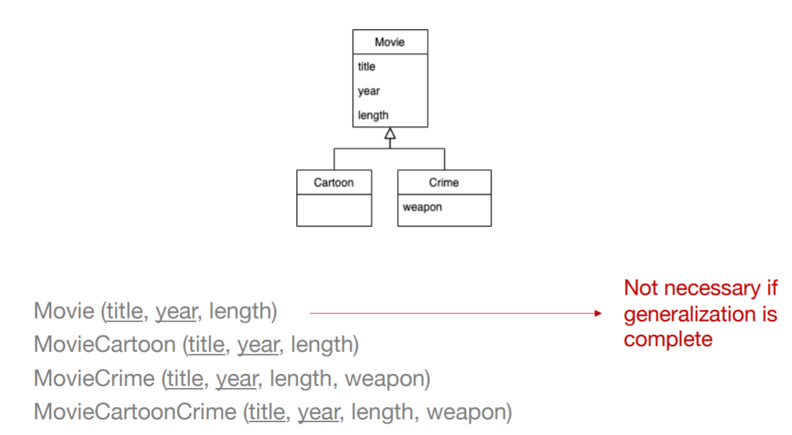
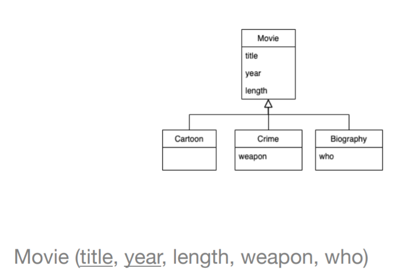

# From UML To Relational Design

## Class
 
- Every class becomes a relation.

## Many To Many Associations

- Add a relation with a key from each side.

## Many To one Associations

- Add a foreign key to the many side relation.

## One To one Associations

- Add a foreign key from one of the relations to the other.

Add the foreign key to the relation that is expected to have
less tuples

Add a unique key constraint to the foreign key:
- So no other tuple can have reference the same tuple from the foreign table
which leads to a one to one association.

## Associations n-ary

- Create a relation with a key from each side.

# Generalizations to  Relational Design

## E/R Style

A relation for each subclass. 

Subclass contains a superclass key + specialized attributes.

##  Object Oriented 

- Create a relation for all possible subtrees of the hierarchy
- Schema has all the possible attributes in that subtree
- In complete generalizations, the relation for the subtree with only the superclass may be eliminated
- Object-oriented because each object belongs to one
and only one subtree

If the generalization is overlapping:

## Use Nulls
- One relation with all the attributes of all the classes
- NULL values on non-existing attributes for a specific
object

## Comparison

### Object-oriented
- Only one tuple per object with components for only the attributes that makes sense
- Minimum possible space usage
  
**Good For :** disjoint generalizations and
superclass has few attributes and subclasses many attributes 

### Use nulls
- Only one tuple per object but these tuples are “long”, they have components for all attributes
- Used space depends on the attributes not being used

**Good For :** heavily overlapping generalizations with a small number of
subclasses

### E/R approach
- Several tuples for each object but only the key attributes are repeated
- Can use more or less space than the nulls method

**Good For :** overlapping generalizations with a large number of subclasses.

# Constraints
- NOT NULL
- UNIQUE
- PRIMARY KEY
- FOREIGN KEY
- CHECK: Ensures that the value in a column meets a specific condition
- DEFAULT :Specifies a default value for a column
- Derived Elements : Treat them as regular elements

