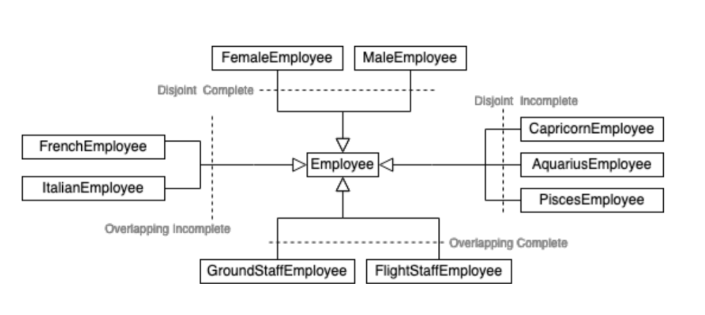

# UML

## Generalization Properties

- **Complete** : If every object in the superclass is in at least one subclass.
- **Incomplete or Partial** : there are objects in the superclass that have no subclass.

- **Disjoint or Exclusive** : if every object is in at most one subclass.
- **Overlapping** : at least one object belongs to more than 1 subclass.

As we can see:

