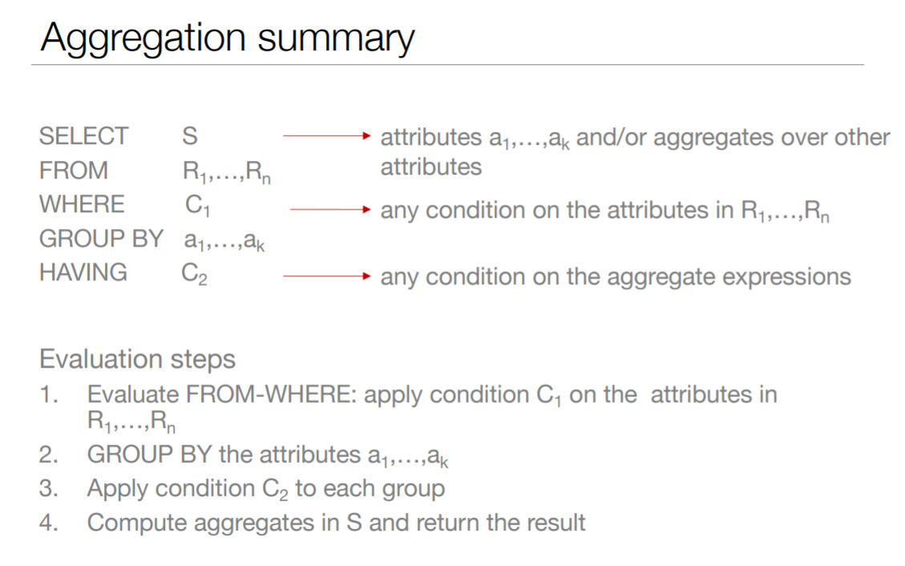

# Aggregation


Syntax :
```sql
SELECT A1, A2, …, An
FROM R1, R2, …, Rm
WHERE condition
GROUP BY columns
HAVING condition
```

Semantics of the query
1. Compute the FROM and WHERE clauses
2. Group by the attributes in the GROUP BY
3. Compute the SELECT clause: grouped attributes and aggregates


## Having Clause 

Applies conditions to the results of aggregate functions
- Check conditions that involve the entire group
- Where clause applies to one tuple at a time

**Where** clause applies to the *FROM* part of the query it filters the data
**Having** is a condition on the aggregate expressions
``` sql
SELECT major
FROM Student, Apply
-- filtering the Student x Apply
WHERE Student.sID = Apply.sID 
GROUP BY major
-- Filtering the result of the aggregate expressions
HAVING max(GPA) < (SELECT avg(GPA) FROM Student);
```

## Group-by versus subqueries


Tambem conseguimos reescrever qualquer query que envolva o having

```sql
SELECT cName
FROM Apply
GROUP BY cName
HAVING count(*) < 5;
```
> This is more efficient

```sql
SELECT DISTINCT cName
FROM Apply A1
WHERE 5 > ( SELECT count(*)
            FROM Apply A2
            WHERE A2.cName = A1.cName);
```
> This is less efficient

Só deve ser usado o group by quando forem usadas funcoes de agregacao

